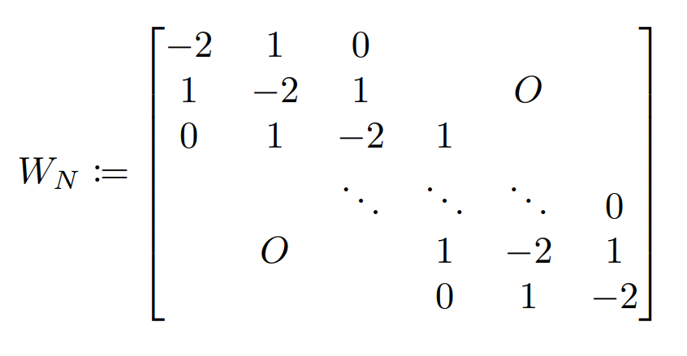

# MakingWaveAnimation
The code for making and saving the animation of wave simulation. (**This code is coming soon!**)

  

## Used Tool
Numerical Calculation Method : **Improved Euler method (Heun's method)**

Language : **MATLAB**

## Detail
### Preliminary
$O_N$ : $N \times N$ zero matrix.

$I_N$ : $N \times N$ identity matrix.

$\Delta x$, $\Delta y$ : Lengths of grid in the simulation area.

$z_{ij}$ : Displacement of a grid point $(i \Delta x,\ j \Delta y)$ where $i$ and $j$ are integer and satisfy $0 \leq i < N$ and $0 \leq j < N$.

$v$ : Velocity of wave.

$\gamma$ : Attenuation coefficient.

### Detail of Algorithm
(1) Displacement matrix $Z$ is defined as $Z = (z_{ij})$. Velocity matrix is $V := \dfrac{d Z}{d t} = \left(\dfrac{d}{d t} z_{ij}\right)$. Let state matrix $X := [Z, V]^T$ .

(2) The differential equation (state equation) that $X$ obeys is as follows

  

where matrix $W$ is

  

(3) The above equation is discretized and carry out numerical calculation. However, due to the fixed-edge condition, the outermost components of $Z$ and $V$ ($4N - 4$ components in total, respectively) are reset to 0 each time the calculation is performed.
